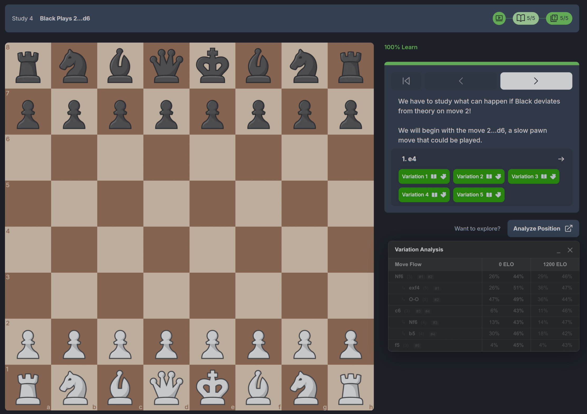

# ♟️ Chessly ELO Prioritizer

**Stop memorizing lines you will never see.**

The **Chessly ELO Prioritizer** is a browser extension that supercharges your Chessly courses. It connects your Chessly course to the Lichess opening database, showing you exactly how popular and successful specific variations are **at your specific rating level**.

[**→ View Technical Documentation for Developers**](./TECHNICAL.md)

## 🚀 Why use this?

Chessly courses are fantastic, but they often cover "Grandmaster Theory" that players at 1200 or 1600 ELO rarely face. This extension helps you prioritize your study time by answering:

1.  **"Will I actually see this move?"** (Frequency check)
2.  **"Is this line too hard for my level?"** (Win rate check)
3.  **"When does this variation split?"** (Tree visualization)

## ✨ Key Features

*   **📊 Personalized Data:** Select your current ELO and your target ELO. See statistics relevant to *you*, not just Super GMs.
*   **🌳 Smart Tree View:** Automatically detects nested variations and visualizes them as a tree, so you know exactly where lines diverge.
*   **🔦 Active Highlighting:** The extension watches the board as you play moves. It highlights the active variation in real-time and dims lines you have deviated from.
*   **🚦 Win Rate Colors:**
    *   🟢 **Green (>50%):** Good win rate for your side.
    *   🔴 **Red (<40%):** Difficult line - proceed with caution.
    *   ⚪ **Gray:** Not enough data or ~40-50% win rate.
*   **💾 Smart Caching:** Saves data locally for 24 hours so your experience is instant and lightning-fast.

## 📥 Installation

**Note:** This extension is currently in Developer Preview.

1.  **Download** the code (or unzip the folder provided).
2.  Open **Google Chrome** (or Edge/Brave).
3.  Navigate to `chrome://extensions`.
4.  Toggle **"Developer mode"** in the top right corner.
5.  Click **"Load unpacked"**.
6.  Select the folder containing the extension files.
7.  Go to any [Chessly](https://chessly.com) course and refresh the page!

## ⚙️ How to Use

1.  **Open a Course:** Navigate to any Chessly lesson with multiple variations (look for the "Analyze" link).
2.  **The Table:** A table will appear automatically in the bottom-right corner after the page loads.
3.  **Configure:** Click the extension icon in your browser toolbar to set your **Current Rating** and **Target Rating**. Click "Update Table" to apply changes.
4.  **Analyze:** As you play through the lesson, the table will highlight where you are in the variation tree.
5.  **Drag & Minimize:** The table can be dragged to any position and minimized with the "_" button.
6.  **Close:** Click the "✕" button to dismiss the table completely.

## ❓ Troubleshooting

*   **Table not appearing?** Refresh the page or verify the lesson has multiple variations (at least 2 lines).
*   **"Rate Limit" error?** Wait 60 seconds. Lichess limits API requests to prevent spam.
*   **Old data showing?** The extension caches data for 24 hours. It will auto-refresh the next day.

## 🔒 Privacy Policy

**We respect your privacy.**
*   This extension runs entirely on your device.
*   It fetches public chess statistics from the [Lichess.org](https://lichess.org) API.
*   No personal data, browsing history, or user info is ever sent to the developer or third parties.
*   Settings are stored locally in your browser.

---
*Not affiliated with Chessly or Lichess. Built by chess fans, for chess fans.*